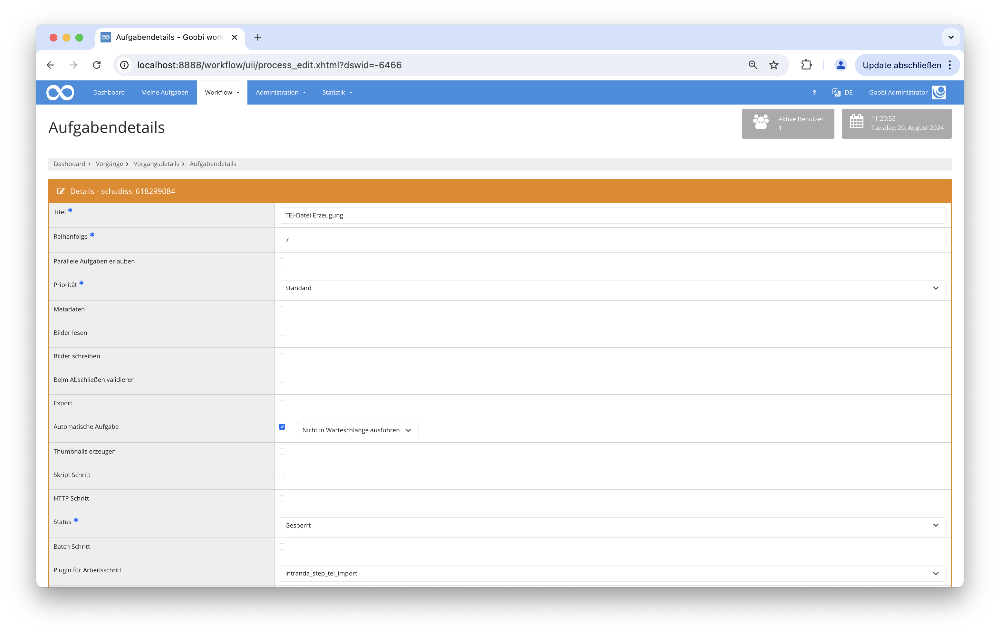

## Einführung
Das Plugin sucht zwischen den hinterlegten ECHO-XML-Dateien nach einer mit den gleichen MPIWG-ID. Diese Datei wird dann mittels einer hinterlegten XSL-Datei in eine TEI-Datei umgewandelt und innerhalb eines dafür definierten Ordners gespeichert. Danach wird diese TEI-Datei in den zugehörigen Goobi-Vorgang kopiert und dort innerhalb des _source-Unterordners gespeichert. Dabei werden die Bildverweise so angepasst, dass diese für den Goobi viewer passen werden. Innerhalb des Goobi viewer wird diese Datei anschließend als Download zur Verfügung stehen.

## Installation
Das Plugin besteht aus zwei Dateien:

```bash
goobi-plugin-step-tei-import.jar
plugin_intranda_step_tei-import.xml
```

Die Datei `goobi-plugin-step-tei-import.jar` enthält die Programmlogik und muss für den tomcat-Nutzer lesbar in folgendes Verzeichnis installiert werden:

```bash
/opt/digiverso/goobi/plugins/step/
```

Die Datei `plugin_intranda_step_tei_import.xml` muss ebenfalls für den tomcat-Nutzer lesbar sein und in folgendes Verzeichnis installiert werden:

```bash
/opt/digiverso/goobi/config/
```

## Überblick und Funktionsweise
Nachdem das Plugin installiert und konfiguriert wurde, kann es innerhalb eines Arbeitsschrittes von Goobi genutzt werden.

Dazu muss innerhalb der gewünschten Aufgabe das Plugin `plugin_intranda_step_tei_import` eingetragen werden. Des Weiteren muss die Checkbox für die Bearbeitung der Metadaten und die Automatische Aufgabe gesetzt sein.



## Konfiguration
Die Konfiguration des Plugins erfolgt innerhalb der Datei `plugin_intranda_step_tei_import.xml` wie hier aufgezeigt:

{{CONFIG_CONTENT}}

{{CONFIG_DESCRIPTION_PROJECT_STEP}}

Parameter               | Erläuterung
------------------------|------------------------------------
`xslFile`               | Hiermit wird der Pfad zur XSL-Datei hinterlegt. |
`teiFolder`             | Dieser Parameter definiert den Ordner, wo die TEI-Dateien erzeugt werden. |
`echoFolder`            | Dieser Parameter definiert den Ordner, wo die ECHO-XML-Dateien liegen. |
`rulesetPath`           | Dieser Parameter liefert den Pfad zum Regelsatz. |
`viewerPages`           | Hiermit wird die URL für den Goobi viewer festgelegt. |
`goobiMMFolder`         | Dieser Parameter definiert Pfad zummetadata Ordner. Er ist allein für Testingzwecke änderbar. |