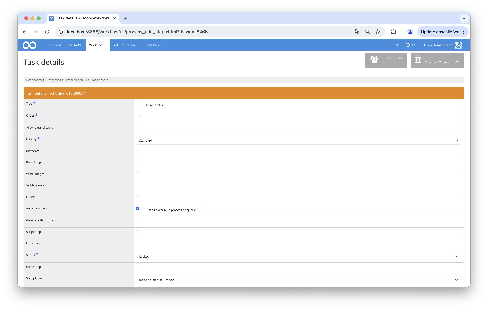

## Intoduction
The plugin searches the stored ECHO XML files for one with the same MPIWG ID. This file is then converted into a TEI file using a predefined XSL file and saved in a designated folder. After that, the TEI file is copied into the Goobi process, into the _source subfolder within the Goobi process image folder. During this process, the image links are translated to the images in the viewer. From there, it is automatically exported (as a "Download" link) when the process is exported to the viewer.

## Installation
The plugin consists of two files:

```bash
goobi-plugin-step-tei-import.jar
plugin_intranda_step_tei-import.xml
```

The file `goobi-plugin-step-tei-import.jar` contains the program logic and must be installed in the following directory, readable by the Tomcat user:

```bash
/opt/digiverso/goobi/plugins/step/
```

The file `plugin_intranda_step_tei_import.xml` must also be readable by the Tomcat user and installed in the following directory:

```bash
/opt/digiverso/goobi/config/
```

## Overview and Functionality
After the plugin is installed and configured, it can be used within a Goobi work step.

To do this, the plugin `plugin_intranda_step_tei_import` must be entered within the desired task. Additionally, the checkboxes for Metadata and Automatic Task must be selected.



## Configuration

The configuration of the plugin is done in the file `plugin_intranda_step_tei_import.xml` as shown here:

{{CONFIG_CONTENT}}

{{CONFIG_DESCRIPTION_PROJECT_STEP}}

Parameter               | Explanation
------------------------|------------------------------------
`xslFile`               | This is used to store the path to the XSL file. |
`teiFolder`             | This parameter defines the folder where the TEI files are created. |
`echoFolder`            | This parameter defines the folder where the ECHO XML files are located. |
`rulesetPath`           | This parameter provides the path to the rule set. |
`viewerPages`           | This sets the URL for the Goobi viewer. |
`goobiMMFolder`         | This parameter defines the path to themetadata folder. It can only be changed for testing purposes. |